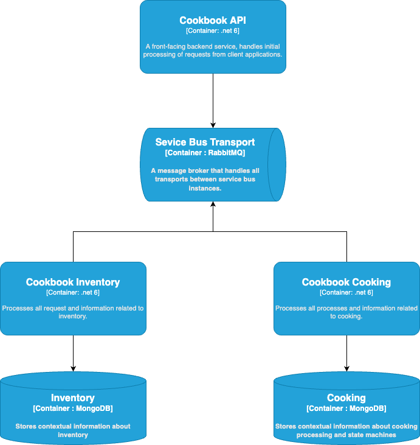
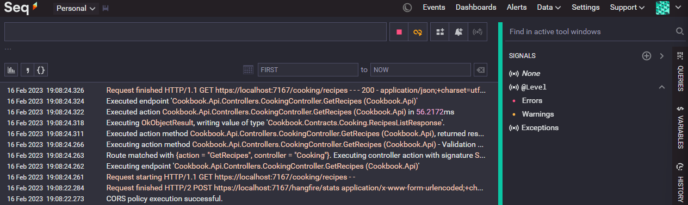
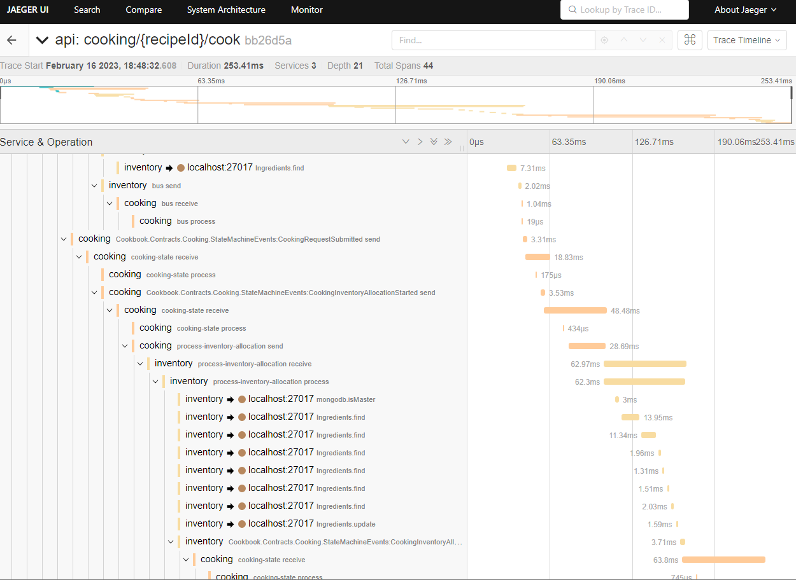
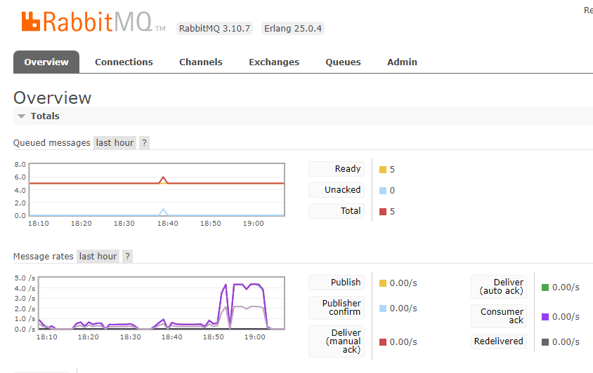
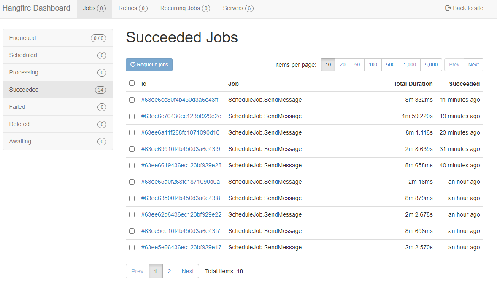
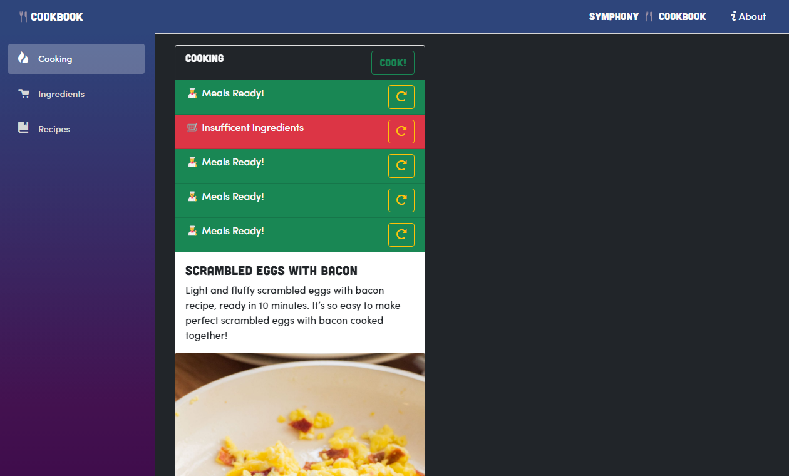
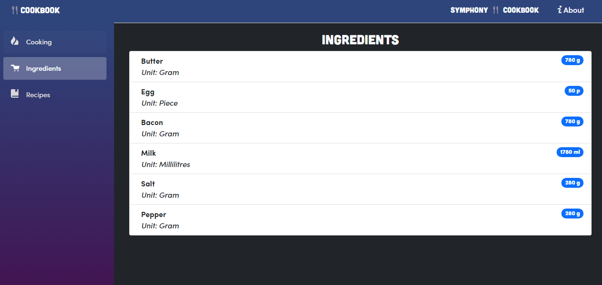
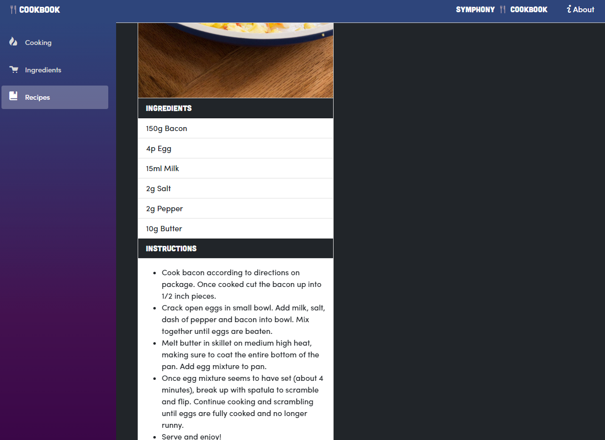

# Cookbook Services

Set of services written for food processing domain, focused on showcasing the implementation of an enterprise service bus.

## Tech stack:
- .Net 6-8
- MassTransit - service bus
- RabbitMQ - message broker
- Seq (with Serilog) - structured logging
- OpenTelemetry (with Jaeger) - telemetry monitoring
- Hangfire - delayed messaging


## System overview  
&nbsp;



System consists of three services, as shown in the image above:

 - Cookbook API - an API that starts all of the processes and allows for interaction with the system through OpenAPI (swagger) page
 - Cookbook Inventory - a service that processes all requests related to ingredients
 - Cookbook Cooking - a service that handles actual processing of ingredients and the cooking process through a distributed transaction using a state machine.

 There are two MongoDB databases, one for each of the backend services, Inventory and Cooking. Each of them stores infomration only related to a part of the process or relevant to their internal processes.

 ## Starting the system

---
Note:   
[Docker](https://www.docker.com/products/docker-desktop/) is mandatory for running this system's dependencies.  
[.Net 6](https://dotnet.microsoft.com/en-us/download) is mandatory for running the services.

---

  By running `docker-compose up` in the `cookbook-docker-services` directory, all of the required services will be setup in your local docker. **Be mindful of the ports as all ports in the system are default ones.**

  *Currently there's no docker image for each of the services, this is on TODO list.*

  After starting up docker containers, navigate to each of the services directories and do a `dotnet run` command, this will start each service individually. When docker deployment is handled this step will be made much easier :)

 ## Relevant URLs

Postman Collection can be found [here](./docs/Cookbook.postman_collection.json).

### Integrations:  
 Seq logging: http://localhost/#/events  
  

Jaeger telemetry: http://localhost:16686/search  
  

RabbitMQ management: http://localhost:15672/#/  
  

Scheduled and delayed messaging: http://localhost:7167/hangfire  


Services:

- API: 
  - OpenAPI - Swagger: https://localhost:7167/swagger
  - Health check - Ready: https://localhost:7167/health/ready
  - Health check - Live: https://localhost:7167/health/live
  - Scheduler - Hangfire: https://localhost:7167/hangfire
- Inventory:
  - Health check - Ready: https://localhost:7168/health/ready
  - Health check - Live: https://localhost:7168/health/live
  - Scheduler - Hangfire: https://localhost:7168/hangfire
- Cooking:
  - Health check - Ready: https://localhost:7169/health/ready
  - Health check - Live: https://localhost:7169/health/live
  - Scheduler - Hangfire: https://localhost:7169/hangfire


## Cookbook Frontend

Cookbook frontend is a blazor webassembly app that allows for interaction with the system through a web browser. It is a single page application that uses the API to communicate with the system. It is a work in progress and is not yet fully functional.





## Introduction

### Scope of the application

*The scope of the application refers to the boundaries and limits of the Cook Book application. It defines what the application will and will not do, and outlines the features and functionality that will be included.*

The Cook Book application is a digital platform that allows users to create and edit a collection of materials and recipes, and to track and manage their inventory of materials. Users can also access recipe recommendations based on the materials they have available. The application will include user accounts with configurable profiles, and will allow users to store and access their materials and recipes from any device. The Cook Book application will not include a shopping or delivery service for materials, and will not allow users to sell or trade materials or recipes.

### Overview of the features

*The overview of the features section of the SDD should provide a high-level summary of the main functionality and features of the Cook Book application. It should give a general idea of how the application works and what it can do for users.*

The Cook Book application is a digital platform that allows users to create and manage a collection of materials and recipes. Users can create and edit their own materials and recipes, and can link recipes to the materials they require. The application also includes an inventory system that allows users to store and track the materials they have available. Based on the materials in their inventory, the Cook Book application will recommend recipes that users can make. The application also includes user accounts with configurable profiles, allowing users to customize their experience and access their materials and recipes from any device. The Cook Book application will also feature a recommendation system that suggests popular recipes to users.

## Materials collection

### Description of the materials collection feature

The Cook Book application allows users to create and manage their own collection of materials. Users can add new materials to their collection by providing the material name and any relevant information (e.g. type, quantity). They can also edit or delete materials from their collection as needed. The materials collection feature includes a search function that allows users to easily find specific materials in their collection. Users can also organize their materials into categories or tags to help them find and manage their materials more easily. In addition to managing their own materials collection, users can also view and access the materials collections of other users who have chosen to share their collections publicly.

## Recipe collection

### Description of the recipe collection feature

The Cook Book application includes a recipe collection feature that allows users to create and manage their own collection of recipes. Users can add new recipes to their collection by providing the recipe name and any relevant information (e.g. ingredients, instructions, serving size). They can also edit or delete recipes from their collection as needed. The recipe collection feature includes a search function that allows users to easily find specific recipes in their collection. Users can also organize their recipes into categories or tags to help them find and manage their recipes more easily. In addition to managing their own recipe collection, users can also view and access the recipe collections of other users who have chosen to share their collections publicly.

## Inventory

### Description of the inventory feature

The Cook Book application includes an inventory system that allows users to store and track their materials. Users can add materials to their inventory by selecting them from their materials collection and specifying the quantity they have available. The inventory system will then track the quantity of each material and update it as users add or remove materials.
Users can view their inventory at any time by accessing the inventory feature in the application. The inventory will display the materials they have available, along with the quantity of each material. Users can also search their inventory to find specific materials, or use the sorting and filtering options to organize their inventory in different ways.
The inventory system also includes a notification system that alerts users when they are running low on certain materials. Users can customize their notification settings to specify which materials they want to receive notifications for, and how they would like to receive the notifications (e.g. email, push notification).
The inventory system is integrated with the recipe recommendation feature, allowing the application to recommend recipes to users based on the materials they have available in their inventory. It also allows users to track the materials used in each recipe and plan their inventory accordingly.

# Testing data sets

## Ingredients

```json
{
   "name": "Butter",
   "quantity": 1000,
   "unit": "Gram"
},
{
   "name": "Egg",
   "quantity": 100,
   "unit": "Piece"
},
{
   "name": "Bacon",
   "quantity": 1000,
   "unit": "Gram"
},
{
   "name": "Milk",
   "quantity": 2000,
   "unit": "Millilitres"
},
{
   "name": "Salt",
   "quantity": 500,
   "unit": "Gram"
},
{
   "name": "Pepper",
   "quantity": 500,
   "unit": "Gram"
}
```
## Recipes

```jsonc
{
  "name": "Scrambled Eggs With Bacon",
  "description": "Light and fluffy scrambled eggs with bacon recipe, ready in 10 minutes. It’s so easy to make perfect scrambled eggs with bacon cooked together!",
  "instructions": "-   Cook bacon according to directions on package. Once cooked cut the bacon up into 1/2 inch pieces. -   Crack open eggs in small bowl. Add milk, salt, dash of pepper and bacon into bowl. Mix together until eggs are beaten. -   Melt butter in skillet on medium high heat, making sure to coat the entire bottom of the pan. Add egg mixture to pan. -   Once egg mixture seems to have set (about 4 minutes), break up with spatula to scramble and flip. Continue cooking and scrambling until eggs are fully cooked and no longer runny. Serve and enjoy!",
  "imageUrl": "https://brooklynfarmgirl.com/wp-content/uploads/2014/09/Scrambled-Eggs-With-Bacon_7-1365x2048.jpg",
  "prepTime": 2,
  "cookTime": 8,
  "servings": 2,
  "ingredients": [
    {
      "ingredientId": "", // bacon id
      "quantity": 150
    },
    {
      "ingredientId": "", // egg id
      "quantity": 4
    },
    {
      "ingredientId": "", // milk id
      "quantity": 15
    },
    {
      "ingredientId": "", // salt id
      "quantity": 2
    },
    {
      "ingredientId": "", // pepper id
      "quantity": 2
    },
    {
      "ingredientId": "", // butter id
      "quantity": 10
    }
  ]
}
```

## Continuation of implementation ideas

"Real-time Inventory Tracking System" for a small retail store or a restaurant.

Business Problem:
 - In a small business like a retail store or a restaurant, managing inventory can be a constant challenge. It's important to know when items are running low and need to be restocked, and it can be difficult to keep track of this in real time, especially during busy periods.
 
Solution Overview:
 - The Real-time Inventory Tracking System uses the real-time image processing system to analyze video feeds from cameras pointed at key areas, such as the store shelves or a restaurant's food storage area. As the video plays, it's divided into individual frames, which are then analyzed for the number and type of items present.

Major Components:
 - Video Capture: This module interfaces with the store's camera system to obtain a real-time video feed of the inventory area.
 - Frame Extraction: As the video feed is processed, it is divided into individual frames, which are then fed into the event queue. Each new frame is an event that triggers the image processing operations.
 - Item Detection and Counting: This module uses image processing techniques to identify and count items in the frame. Initially, this could be as simple as counting the number of visible items on a shelf or in a storage area.
 - Inventory Update: This module updates the inventory based on the item count from the previous step and flags items that are running low.
 - Results Display / Reporting: The results of the inventory analysis are displayed to the user in real time, and are also aggregated into reports for later analysis.

AI Integration:

As the system evolves, AI techniques could be introduced to enhance its capabilities:
 - Object Recognition: AI could be used to identify specific items in the frame, allowing for more detailed inventory tracking.
 - Predictive Analysis: Based on the rate at which items are depleted, AI could be used to predict when each item will run out, helping to optimize restocking schedules.

This project is a smaller scale and more feasible for a small business, but it still involves event-driven programming and CPU-intensive operations, and it also has a clear business use case. Furthermore, the addition of AI features provides a path for future development and enhancement.